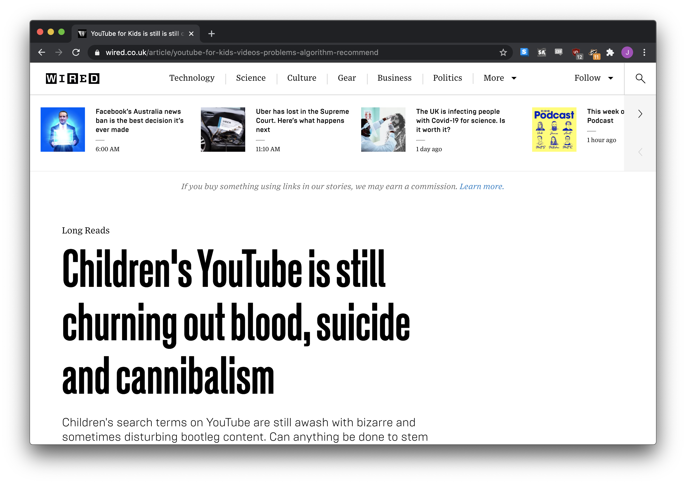

## Hi, I'm Soma

Lede Program, Columbia Journalism School

[js4571@columbia.edu](mailto:js4571@columbia.edu) [\@dangerscarf](https://twitter.com/dangerscarf)

[investigate.ai](http://investigate.ai) [littlecolumns.com](http://littlecolumns.com) [ledeprogram.com](http://ledeprogram.com) 

::: notes
I'm Jonathan Soma, I run a data journalism program at Columbia's J-School called the Lede, where I spend all of my time trying to make coding and data and stuff easy for people to learn.

Along with that, I like to make tutorials and open-source tools to make it easier for people out there in the field who are actual real-live journalists to do things. 
:::
---

## Persine

[github.com/jsoma/persine](https://github.com/jsoma/persine)

[persine.readthedocs.io](https://persine.readthedocs.io/)

::: notes
And today I'm here to talk about one of those tools, it's called Persine, I just put it together over winter break, it's pretty fresh and I'm pretty excited about it. So let's get into it.

When you open the digital equivalent of a newspaper these days, people are always talking about algorithms.
:::
---


::: notes
We didn't give the right people priority to get vaccinated "oh it was the algorithm" 
:::
---


::: notes
We turned everyone into a far-right radical "oh it was the algorithm"
:::
---


::: notes
We keep putting black people in jail "oh it was the algorithm"
:::
---

## Researching algorithms

* FOIA
* Logistic regression [a tutorial if you're curious](https://investigate.ai/regression/logistic-regression/)
* Source code analysis
* Researching
* Reporting

::: notes
It's kind of the catch-all secret monster that runs around computer systems and does all the bad stuff. And there's plenty of journalists out there who are doing research on this, reverse engineering algorithms, shining light on whether they're racist, things like that, but it's almost always a lot of work. A lot of FOIA requests, maybe a logistic regression or two, maybe reading some source code. It's just not easy to do a really in-depth job without a lot of time and effort.
:::

---


::: notes
As a result, we end up with two directions. One, highly technical pieces, but then a lot of pieces that maybe come less technical people end up with are just.
:::

---


::: notes
"I clicked around on a website, and this is how it made me feel." Or, I visited YouTube from three different incognito windows, clicked around, and here's what I found.

Now this kind of research is not to be discounted, but it doesn't have the depth or reproducibility that we often look for in these pieces. So I said hey, everyone should be able to do this kind of in-depth research in a really cool impressive and understandable way.
:::
---

## Enter: Persine


"Persine is an automated tool to study and reverse-engineer algorithmic recommendation systems, like YouTube videos and Amazon products. It has a simple interface and encourages reproducible results."

::: notes
And so I made Persine.

Persine is technically a Python library, but if you're intimidated by that, don't worry, you don't need to know Python to use it. You don't really need to know how to code at all, really, but saying that let's just jump right into some code:
:::
---

```py
from persine import PersonaEngine

engine = PersonaEngine()

with engine.persona() as persona:
   persona.run_batch([
      "https://www.youtube.com/watch?v=hZw23sWlyG0",
      "youtube:next_up#3",
      "youtube:homepage"
   ])
   persona.history.to_csv("history.csv")
   persona.recommendations.to_csv("recs.csv")
```

::: notes
You only need to know three lines here. In this code, we say hey, Persine let's open up the browser. You're going to be a brand-new person in this browser, it's not going to be connected to your history or your cookies or anything like that, it's brand new, blank slate. Google or Amazon or whoever kind of has no idea who you are.

So we say hey, go watch this one YouTube video. We just pop the URL in, right there. And then click the 'next up' video, watch that, click the next up video, watch that. So you're clicking 'next up' three times. And then at the end, visit the youtube homepage.

Pretty boring, right? Not awfully exciting.

But what happened behind the scenes is in every step Persine was tracking what YouTube was doing. It was scraping every single recommendation that YouTube showed us. The sidebar recommendations, the homepage recommendations, sponsored content, it was tracking all of that. It paid attention to what the 'next up' video was that YouTube suggested we watch, along with everything else on the page. So for a new user, without any history, knowing only that we're interested in this one video, we can ask: what does YouTube show us?

And as long as we're technical enough to open a CSV file or two, Persine can tell us.
:::

---

## Let's run Persine!

[Run Persine on Google Colab](https://colab.research.google.com/drive/1eAbfwV9mL34LVVIzW4AgwZt5NZJ21LwT?usp=sharing)

---

## What can it do?

YouTube and Amazon

::: notes
Currently Persine can read recommendations on YouTube, and also on Amazon but it might need a little work there. So all you need to do is come up with an idea based on recommendations, and Persine will go out and do all of the data work for you.

And if someone wants to reproduce that data work, all you need to do is give them those three lines. They can run it themselves, see if anything changes since they're running in LA and you're in NY, or if we run a year from now if something else happens.

All you need to know is how to come up with an idea about recommendations. Let's see how a few of these could be done with Persine.
:::
---

[YouTube, the Great Radicalizer](https://www.nytimes.com/2018/03/10/opinion/sunday/youtube-politics-radical.html) by Zeynep Tufekci (NYT)


---

[Children's YouTube is still churning out blood, suicide and cannibalism](https://www.wired.co.uk/article/youtube-for-kids-videos-problems-algorithm-recommend) by K.G. Ophanides (Wired)



---

[YouTube’s Algorithm Accused of Facilitating Paedophile Rings](https://videoweek.com/2019/02/19/youtube-algorithm-accused-of-facilitating-paedophile-rings/) by Tim Cross (Videoweek)


---

['Fiction is outperforming reality': how YouTube's algorithm distorts truth](https://www.theguardian.com/technology/2018/feb/02/how-youtubes-algorithm-distorts-truth) by Paul Lewis (The Guardian)


---

[The New Zealand shooting shows how YouTube and Facebook spread hate and violent images — yet again](https://www.washingtonpost.com/technology/2019/03/15/facebook-youtube-twitter-amplified-video-christchurch-mosque-shooting/) (Washington Post)


---

## And Amazon, too!

Persine also works on Amazon, although it's not as well tested, and Amazon's website is kind of insane. You can see what's surfaced in search results, what's listed as recommendations on product pages or on the Amazon homepage.

**It's also easily extendable to other websites**

---

## Thanks!

[js4571@columbia.edu](mailto:js4571@columbia.edu) [\@dangerscarf](https://twitter.com/dangerscarf)

[investigate.ai](http://investigate.ai) [littlecolumns.com](http://littlecolumns.com) [ledeprogram.com](http://ledeprogram.com) 


[github.com/jsoma/persine](https://github.com/jsoma/persine)

[persine.readthedocs.io](https://persine.readthedocs.io/)
